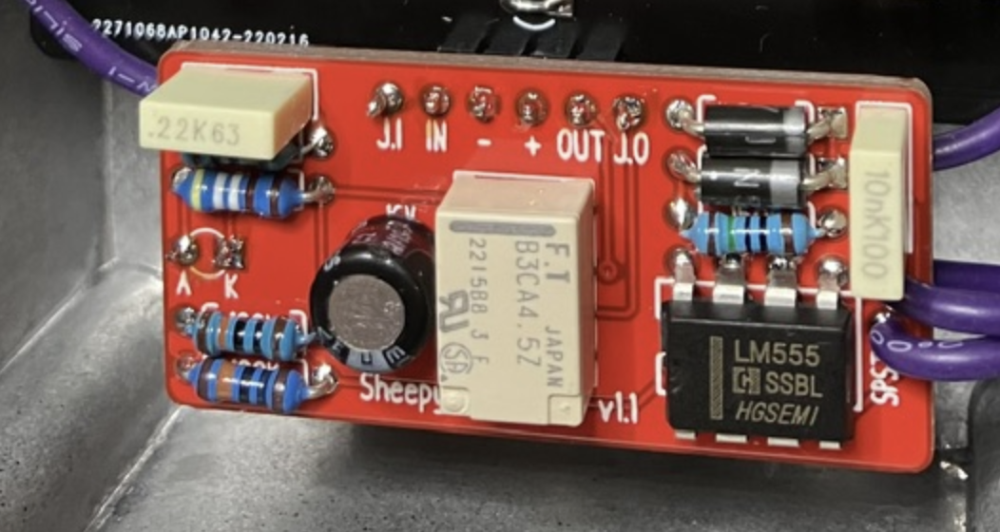
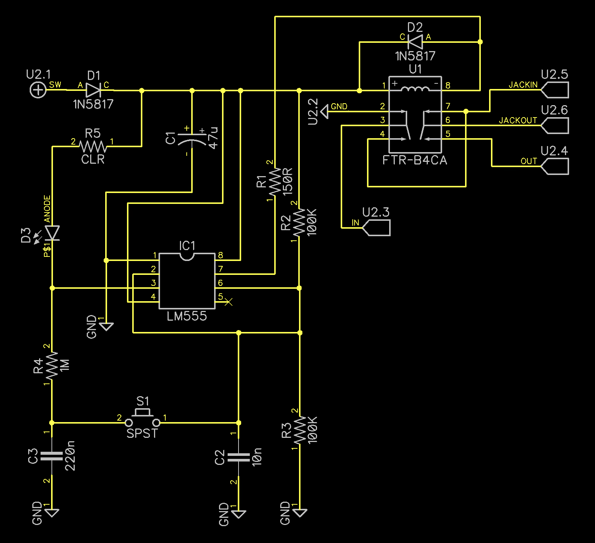
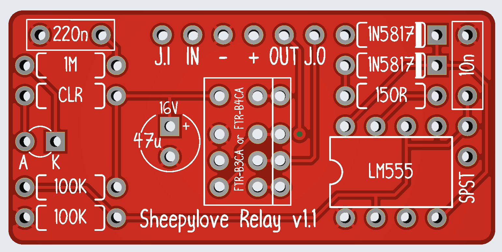
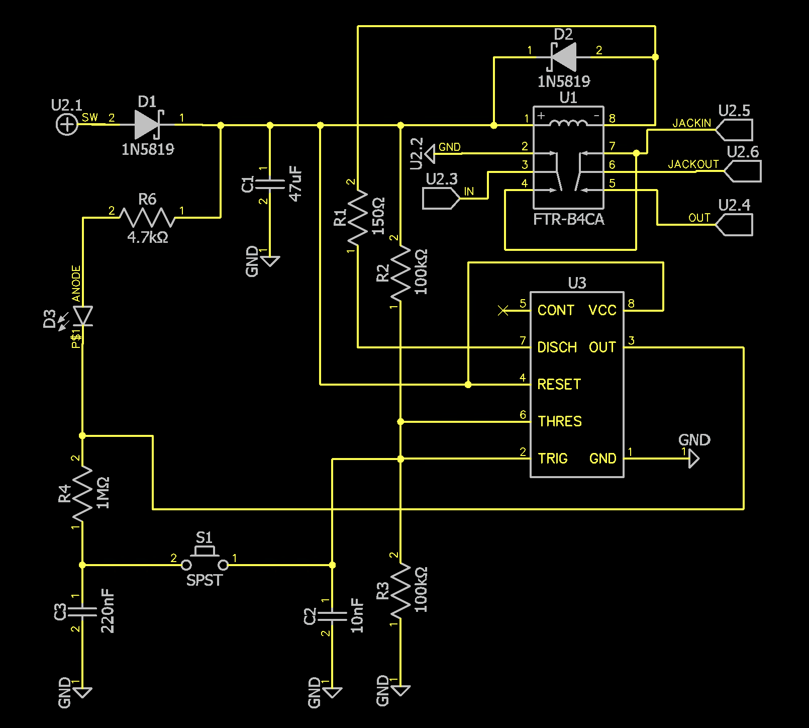
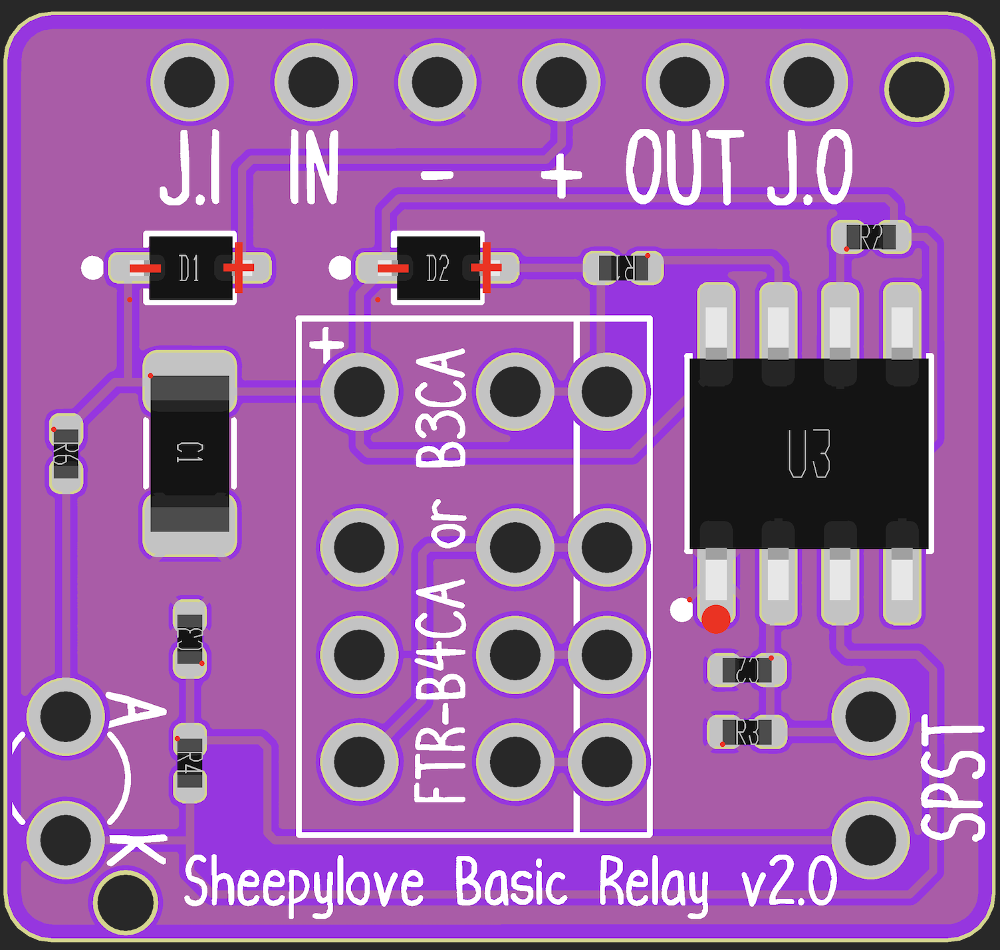

# pedal-simple-relay

 This work is licensed under a <a rel="license" href="http://creativecommons.org/licenses/by-nc-sa/4.0/">Creative Commons Attribution-NonCommercial-ShareAlike 4.0 International License</a>.

If you want to use these commercially, just reach out and we can chat.

## Introduction

Simple relay designs for use in DIY effects pedals. I want to share these because this is what the DIY effects community is all about.

There is no support supplied or guaranteed for these just because I can't scale my time to support others, as much as I would love to.

My preferred method to use these is to connect them to the PCB with pin headers.

## Simple relay v1.1

Through-hole implementation of a [design by Chuck D. Bones](https://forum.pedalpcb.com/threads/a-simple-relay-bypass.16474/) at the [PedalPCB forums](https://forum.pedalpcb.com/).

This is based around the Fujitsu [FTR-B3A4.5](https://www.fcl.fujitsu.com/downloads/MICRO/fcai/relays/ftr-b3.pdf) and [FTR-B4A4.5](https://www.fcl.fujitsu.com/downloads/MICRO/fcai/relays/ftr-b4.pdf) signal relays. Either can be used.

[Bill of Materials](relay-v1.1/relay-v1.1-bom.pdf)

[Gerber](relay-v1.1/relay-v1.1-gerber.zip)

[Gerber with JLCPCB location](relay-v1.1/relay-v1.1-gerber-JLCPCB.zip)

## Simple relay v2.0

SMT implementation of a [design by Chuck D. Bones](https://forum.pedalpcb.com/threads/a-simple-relay-bypass.16474/) at the [PedalPCB forums](https://forum.pedalpcb.com/).

It's the same as the through-hole but made for SMT assembly at JLCPCB, it uses basic parts except for the relay. You may want to purchase the relay separately and install it yourself to save costs.

This is based around the Fujitsu [FTR-B3A4.5](https://www.fcl.fujitsu.com/downloads/MICRO/fcai/relays/ftr-b3.pdf) and [FTR-B4A4.5](https://www.fcl.fujitsu.com/downloads/MICRO/fcai/relays/ftr-b4.pdf) signal relays. Either can be used.

[Bill of Materials (PDF)](relay-v2.0/relay-v2.0-bom.pdf)

[Bill of Materials for JLCPCB Assembly](relay-v2.0/relay-v2.0-bom.csv)

[Pick and Place for JLCPCB Assembly](relay-v2.0/relay-v2.0-cpl.csv)

[Gerber](relay-v2.0/relay-v2.0-gerber.zip)

[Gerber with JLCPCB location](relay-v2.0/relay-v2.0-gerber-JLCPCB.zip)

