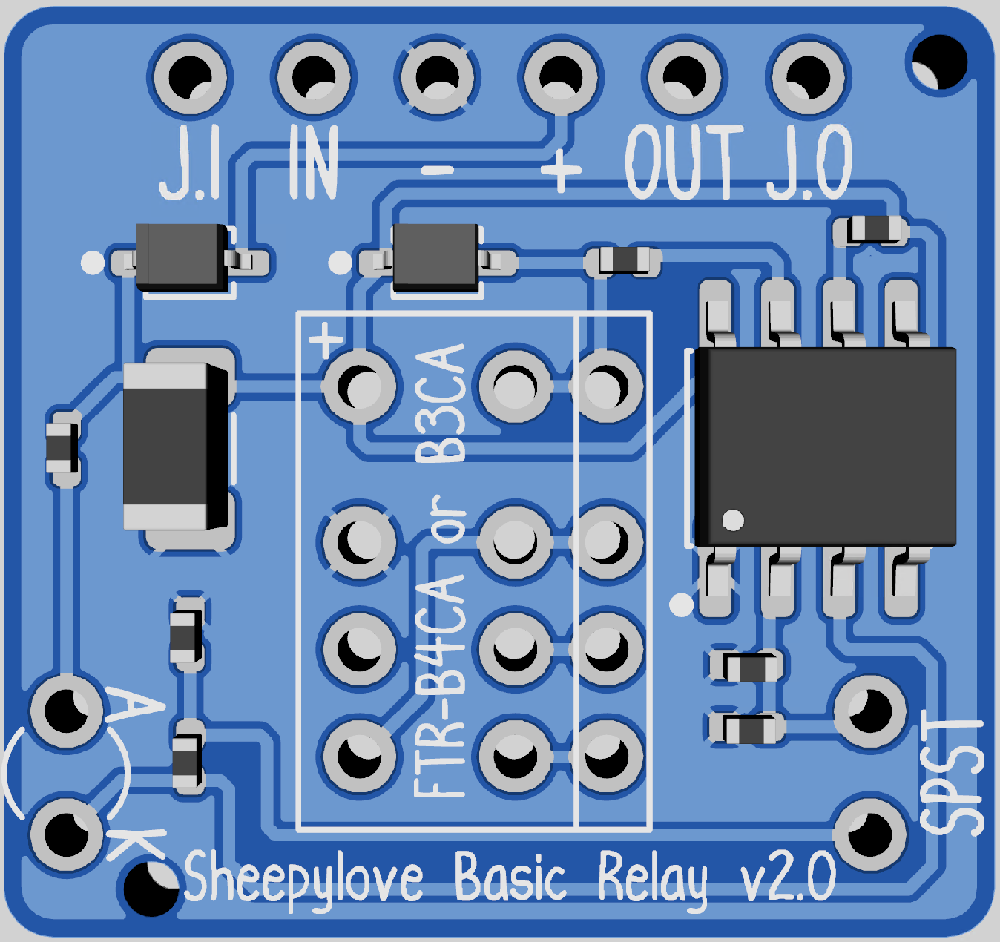

# pedal-simple-relay

 This work is licensed under a <a rel="license" href="http://creativecommons.org/licenses/by-nc-sa/4.0/">Creative Commons Attribution-NonCommercial-ShareAlike 4.0 International License</a>.

If you want to use these commercially, just reach out and we can chat.

## Description

Simple relay designs for use in DIY effects pedals.

This repository contains:

* A gerber file to produce the PCB.
* A gerber file to produce the PCB with a location specified for the production number if using JLCPCB.

There is no support supplied or guaranteed for the PCB. I have built it and it works, YMMV.

## Simple relay v1.1

Through-hole implementation of a [design by Chuck D. Bones](https://forum.pedalpcb.com/threads/a-simple-relay-bypass.16474/) at the [PedalPCB forums](https://forum.pedalpcb.com/).

This is based around the Fujitsu [FTR-B3A4.5](https://www.fcl.fujitsu.com/downloads/MICRO/fcai/relays/ftr-b3.pdf) and [FTR-B4A4.5](https://www.fcl.fujitsu.com/downloads/MICRO/fcai/relays/ftr-b4.pdf) signal relays. Either can be used.

[Bill of Materials](relay-v1.1/relay-v1.1-bom.pdf)

[Gerber Zip File](relay-v1.1/relay-v1.1-gerber.zip)

[Gerber Zip File with JLCPCB location](relay-v1.1/relay-v1.1-gerber-JLCPCB.zip)

## Simple relay v2.0

SMT implementation of a [design by Chuck D. Bones](https://forum.pedalpcb.com/threads/a-simple-relay-bypass.16474/) at the [PedalPCB forums](https://forum.pedalpcb.com/).

It's the same as the through-hole but made for SMT assembly at JLCPCB, it uses basic parts except for the relay. You may want to purchase the relay separately and install it yourself to save costs.

This is based around the Fujitsu [FTR-B3A4.5](https://www.fcl.fujitsu.com/downloads/MICRO/fcai/relays/ftr-b3.pdf) and [FTR-B4A4.5](https://www.fcl.fujitsu.com/downloads/MICRO/fcai/relays/ftr-b4.pdf) signal relays. Either can be used.

